# Applicability — one flowchart from the primary asset down to every obligation on what protects it

Started 2026-09-19 (#197) at the owner's request; rebuilt the same day (#199) after his corrections and a reading of the
texts: *"These 'layers' of applicability for the various standards are incredibly important as they are the kick off point
for the various requirements … the next logical step in these flowcharts is to incorporate all of them into a single
flowchart with the various standards attached to them at the appropriate locations."* And on the shape: *"I would prefer that
the flowchart starts with assets and works its way down from there … if the client has an asset, they can follow it through
to determine all of the compliance obligations pertaining to that asset."* So the chart starts at the primary asset — its
BES status, the bus at its terminals, its voltage and its station — and flows down to the protection systems and relays
that protect it, attaching each standard's requirement parts where they bind.

**Nothing here is from memory** (the owner, 2026-09-19, #198). Every box that states what a standard says was read from
the text named in *Sources* at the end, in the version in force in New Brunswick on 2026-09-19 (nbeub.ca), and names the
clause. A box marked **to read** names a document not yet read and asserts nothing of its content. A box marked **rule
differs** is where the platform's rule today (`tools/compliance_rules.py`) reads the standard wrongly; those are the next
increment, listed at the end.

Colour key of the drawn page (the same words are in the boxes here): *fact* — a fact a rule reads or a test the standard
sets; *binds* — requirements attach here; *does not apply* — with the reason kept; *undetermined* — a fact nobody has
recorded; *open / to read* — a layer not modelled or a text not read.

## The chart — read it from the asset down

```mermaid
flowchart TD
    ASSET["PRIMARY ASSET — a line, transformer, bus, generator, capacitor, reactor (asset.vPrimaryAsset)<br/>its voltage class · its terminals and the station at each · the bus at each terminal · the protection systems (schemes) that protect it and the relays in them"]:::fact

    ASSET --> BESQ{"Is the asset a BES element?<br/>Glossary BES (in force 2014-07-01): all Transmission Elements operated at 100 kV or higher and Real/Reactive Power resources connected at 100 kV or higher, not local distribution; inclusions I1–I5 (e.g. I1 transformers with primary and a secondary terminal at 100 kV+), exclusions E1–E4 (radial systems serving only load, local networks…)<br/>In NB every appendix reads “BES” as the bulk power system of the NB Reliability Standards Regulation — to read<br/>platform: BesStatus recorded on the element"}:::fact
    BESQ -->|Not BES| NOBES["none of these standards' obligations reach its protection through the element"]:::no
    BESQ -->|unrecorded| U0["undetermined — every branch below waits on it"]:::unk
    BESQ -->|BES| BES["BES element"]:::fact

    %% ── branch 1: NPCC A-10 → Directory 4 ──
    BES --> BUS{"the bus at the terminal the scheme protects from — the NPCC A-10 study's BPS / non-BPS outcome<br/>platform: NpccBulkPowerSystem declared by hand on the element, else the bus's (#196); the studies group's feed and a connectivity model later"}:::fact
    BUS -->|BPS| D4["every protection system protecting the asset is bound by NPCC Directory 4 R5.1 (design criterion; TFSP evidence outside the platform; text read at #184, not re-read)"]:::bind
    BUS -->|Not BPS| D4N["Directory 4 does not apply"]:::no
    BUS -->|nothing declared| U5["undetermined"]:::unk

    %% ── branch 2: PRC-023-6 ──
    BES --> V{"PRC-023-6 4.2 — is the asset a circuit subject to R1–R5?<br/>4.2.1.1 line operated at 200 kV and above (except an element connecting a GSU used only to export a BES generator) · 4.2.1.4 transformer whose LOW-voltage terminal connects at 200 kV and above · 4.2.1.2/3/5/6 lines and transformers below that, on the Planning Coordinator's R6 list<br/>platform: device.protects.terminal.voltage ≥ 200 kV, or Prc023 = Listed on the element"}:::fact
    V -->|not a 4.2 circuit| NO1["PRC-023 does not apply to its relays — the circuit"]:::no
    V --> FIX2["rule differs: for a transformer the test is the low-voltage terminal's connection; the rule reads one terminal's voltage"]:::fix
    V -->|a 4.2 circuit| RELAYS["each protection system at each terminal of the asset, and each relay in it"]:::fact
    RELAYS --> F{"4.1 / Attachment A — the elements in service in that relay (scheme.CommissionedFunction at its position)<br/>in, A.1: phase distance 1.1 · out-of-step 1.2 · switch-on-to-fault 1.3 · overcurrent 1.4 · POTT/PUTT/DCB/DCUB 1.5 · phase OC supervision of a current-based pilot scheme that trips on loss of comms 1.6<br/>out, A.2: enabled only when other relays fail 2.1 · ground fault detection 2.2 · RAS-only 2.5 · 15-min-or-slower 2.6 · thermal emulation 2.7 · dc lines 2.8 · dc converter transformers 2.9"}:::fact
    F -->|"an element ruled load-responsive (21 · 78 · SOTF · 50 · 51 · 67, not ground)"| R1["PRC-023 R1 binds that relay — any one of criteria 1–13 at 0.85 pu and 30°"]:::bind
    F -->|"every element ruled not (ground A 2.2; 87T · 25 · 27 · 59 · 79 · 50BF not listed)"| NO2["does not apply to that relay — no in-service load-responsive element; device.functions.note says which and why"]:::no
    F -->|"an element nobody has ruled"| U4["undetermined — 1 437 of 3 203 commissioned rows on DEV"]:::unk
    F --> FIX3["rule differs: 87 is blanket-ruled; A 1.6 brings a line differential scheme's phase OC supervision in when it trips on loss of comms"]:::fix
    F --> X3["open: A 2.8 / 2.9 — Eel River HVDC's dc-side and converter-transformer relays are excluded; nothing marks them · A 2.1 loss-of-potential-only elements · enablement from the settings masks"]:::open
    R1 --> CRIT["asset.formula.prc023_criterion — the group applies 1, then 2, then 13, then 12"]:::fact
    CRIT -->|"7, 8, 9, 12 or 13"| R3["PRC-023 R3 — the calculated capability becomes the asset's Facility Rating, agreed with PC, TOP, RC"]:::bind
    CRIT -->|2| R4["PRC-023 R4 — the asset on the yearly circuit list to PC, TOP, RC"]:::bind
    CRIT -->|12| R5["PRC-023 R5 — the asset on the yearly circuit list to the Regional Entity"]:::bind
    CRIT --> FIX4["rule differs: prc023_r3 reads criterion 13 only"]:::fix

    %% ── branch 3: CIP-002 → CIP-004…011 ──
    BES --> STN{"CIP-002 Attachment 1 — the station or substation where the asset's Facilities are<br/>Medium 2.4: Transmission Facilities at 500 kV and above · 2.5: 200–499 kV at a station connected at 200 kV+ to 3 or more other stations with weighted value over 3000 (700 per 200–299 kV line, 1300 per 300–499 kV line) · 2.6 IROL-critical · 2.7 NPIR · 2.8 generation interconnection · 2.9 SPS/RAS · 2.10 UFLS/UVLS 300 MW+<br/>Low 3.2: every other BES Cyber System at a transmission station (R1.3: no discrete list) · High 1.1–1.4: Control Centers only<br/>platform: CipImpactRating held on the building (#195)"}:::fact
    STN --> CYBER["each Cyber System associated with those Facilities — the relays protecting the asset, their EACMS, PACS and the other Cyber Assets on their ESP"]:::fact
    CYBER --> EX{"4.2.3 exemptions — Cyber Assets at a Facility regulated by the CNSC (4.2.3.1); Cyber Assets of comm networks and data links between discrete ESPs (4.2.3.2)"}:::fact
    EX -->|exempt| EXO["exempt from CIP — open: nothing marks a CNSC Facility or an inter-ESP link"]:::open
    EX -->|not exempt| T{"each relay's technology (ref.Model.Technology) — Glossary: a Cyber Asset is a programmable electronic device"}:::fact
    T -->|Electromechanical or Static| NCA["not a Cyber Asset — no CIP requirement attaches to that relay"]:::no
    T -->|Microprocessor or IEC61850| CA["Cyber Asset"]:::fact
    CA --> BCAQ{"BES (BPS) Cyber Asset test — NB appendix CIP-002-5.1a-NB-0 §G: unavailable, degraded or misused → within 15 minutes adversely impacts a Facility whose loss affects the reliable operation of the bulk power system; redundancy not considered<br/>platform proxy: protects this BES element (the 15-minute judgement itself is not modelled)"}:::fact
    BCAQ -->|yes| BCA["BES Cyber Asset (derived) — grouped into a BES Cyber System, CIP-002 R1, rated by the station above"]:::fact
    BCAQ -->|no| PCAQ{"connected by a routable protocol within or on the ESP of a BES Cyber System? Glossary PCA (in force to 2028-06-30) — open: no ESP is modelled"}:::open
    PCAQ -->|yes| PCA["Protected Cyber Asset — takes the rating of the highest BES Cyber System in the same ESP (from 2028-07-01: protected by an ESP, or sharing CPU/memory; TCAs excluded)"]:::fact
    PCAQ -->|no| NOC["no CIP requirement (30 days or less for maintenance = Transient Cyber Asset, CIP-010 R4 plans)"]:::no
    BCA --> RATE{"the station's rating"}:::fact
    PCA --> RATE
    RATE -->|no criterion met, none recorded| U2["undetermined"]:::unk
    RATE -->|Low| LOW["Low impact — CIP-003-8-NB-0 in force, CIP-003-9-NB-0 effective 2026-10-01 — to read"]:::open
    RATE -->|High| HONLY["High (Control Centers): adds CIP-004 R5.3–5.4 · CIP-006 R1.3 · CIP-007 R4.4 · CIP-010 R1.5, R2.1, R3.2, R3.3"]:::bind
    RATE -->|Medium| MALL["Medium, ERC or not — BCS + EACMS + PACS + PCA unless noted<br/>CIP-004 R1.1 (BCS) · CIP-005 R1.1 (BCS + PCA) · CIP-006 R1.1 (BCS without ERC: procedural physical controls)<br/>CIP-007 R2.1–2.4, R3.1–3.3, R4.1, R5.2, R5.4, R5.5 · CIP-010 R1.1–1.4, R1.6, R3.1, R3.4, R4 (BCS + PCA)<br/>CIP-011 R1.1–1.2 (not PCA), R2.1–2.2"]:::bind
    MALL --> ERC{"External Routable Connectivity — of the BCS through its ESP, not of the relay<br/>Glossary: access to a BCS from a Cyber Asset outside its ESP via a bi-directional routable protocol connection · platform: recorded by hand on the device"}:::fact
    ERC -->|ERC| MERC["with ERC, adds:<br/>CIP-004 R2.1–2.3, R3.1–3.5, R4.1–4.3, R5.1–5.2, R6.1–6.3 (BCS + EACMS + PACS, not PCA)<br/>CIP-005 R1.2, R2.1–2.5 (BCS + PCA), R3.1–3.2 (EACMS + PACS)<br/>CIP-006 R1.2, R1.4, R1.5, R1.8, R1.9, R2.1–2.3, R3.1 (PACS: R1.6, R1.7) · CIP-007 R1.1, R4.2, R5.1, R5.3, R5.6"]:::bind
    ERC -->|No ERC| MNOE["with No ERC these do not apply: CIP-004 R2–R6 · CIP-005 R1.2, R2 · CIP-006 R1.2–1.9, R2 · CIP-007 R1.1, R4.2, R5.3, R5.6"]:::no
    ERC -->|unrecorded| U3["undetermined"]:::unk
    MALL --> MCC["at a Control Center only — not a substation relay: CIP-005 R1.5 · CIP-006 R1.10 · CIP-007 R1.2, R4.3, R5.1, R5.7"]:::no
    MALL --> DIAL["Dial-up Connectivity: CIP-005 R1.4 (BCS + PCA) — open: not modelled"]:::open
    MALL --> FIX1["rule differs today: cip004_r2 / cip004_r4 bind without ERC · cip005_r1 carries ERC for all of R1 · cip007_r1 binds without ERC · cip010_r2 opens at Medium (High only)"]:::fix

    classDef fact fill:#cfe3f3,stroke:#1f5f8b,color:#102030;
    classDef bind fill:#d6f0d6,stroke:#2e7d32,color:#102010;
    classDef no fill:#e9ecef,stroke:#6c757d,color:#202428;
    classDef unk fill:#fff3cd,stroke:#8a5a00,color:#3a2a00;
    classDef open fill:#fde2e2,stroke:#b23a3a,color:#3a1010;
    classDef fix fill:#ffd8a8,stroke:#c05a00,color:#3a1a00;
```

## Where each requirement sits — read from the Applicable Systems columns

| Standard (NB version in force) | Applies to Medium **without** ERC | Applies to Medium **with** ERC only | Medium at Control Centers only | High only | Reaches PCA? |
|---|---|---|---|---|---|
| CIP-004-7 | R1.1 | R2.1–2.3, R3.1–3.5, R4.1–4.3, R5.1–5.2, R6.1–6.3 | — | R5.3, R5.4 | No (EACMS, PACS only) |
| CIP-005-7 | R1.1 | R1.2, R2.1–2.5, R3.1–3.2 (EACMS, PACS) | R1.5 (EAPs) | — | Yes (R1, R2) |
| CIP-006-6 | R1.1 | R1.2, R1.4, R1.5, R1.6–1.7 (PACS), R1.8, R1.9, R2.1–2.3, R3.1 | R1.10 | R1.3 | Yes (R1, R2) |
| CIP-007-6 | R2.1–2.4, R3.1–3.3, R4.1, R5.2, R5.4, R5.5 | R1.1, R4.2, R5.1, R5.3, R5.6 | R1.2, R4.3, R5.1, R5.7 | R4.4 | Yes (all) |
| CIP-010-4 | R1.1–1.4, R1.6, R3.1, R3.4, R4 | — | — | R1.5, R2.1, R3.2, R3.3 | Yes (R1, R3, R4) |
| CIP-011-3 | R1.1–1.2, R2.1–2.2 | — | — | — | R2 yes; R1 no |
| PRC-023-6 | R1 where 4.2 and Attachment A both hold; R3 for criteria 7, 8, 9, 12, 13; R4 for criterion 2; R5 for criterion 12 | | | | |
| CIP-003-8 (Low) | to read | | | | |

"Medium" here means a Medium impact BES Cyber System and, where the column says so, its associated EACMS, PACS and PCA.
A relay that is a PCA in a Medium ESP takes the PCA-reaching parts and none of CIP-004 or CIP-011 R1.

## What the platform's rules must change (the next increment)

Read against the texts above, five of the thirteen CIP rules and two PRC-023 pieces are wrong today:

1. `cip004_r2`, `cip004_r4` — bind only with ERC at Medium (they bind every Medium BCA today).
2. `cip005_r1` — part 1.1 binds every Medium BCS and its PCA, ERC or not; only 1.2 carries ERC (the rule carries ERC for all of R1).
3. `cip007_r1` — part 1.1 binds Medium only with ERC (the rule binds without).
4. `cip010_r2` — High only; never at a Medium substation (the rule opens it there).
5. `prc023_r3` — criteria 7, 8, 9, 12 or 13 (the rule reads 13 only).
6. `ref.AnsiFunction` ruling for 87 — right for 87T; A 1.6 brings the phase overcurrent supervision of a current-based pilot
   scheme (line differential included) in when the scheme trips on loss of communications: rule 87L's supervising elements
   per scheme, not by the number.
7. The rules are written per requirement; the standards bind per **part**. The honest shape is one rule per part-group
   (the rows of the table above), so an obligation names the parts it stands for.

Also open, with no rule yet: the PCA layer (needs an ESP model); the exemptions (CNSC facility; inter-ESP links); Low
impact (CIP-003, to read); Dial-up; the NB Regulation's definition of the bulk power system, which is what "BES" means in
every NB appendix (to read); the NB appendices of CIP-004 to CIP-011 (their §G definitions not read this session).

## Sources read (2026-09-19)

- PRC-023-6 — https://www.nerc.com/pa/Stand/Reliability%20Standards/PRC-023-6.pdf (4.1, 4.2, R1–R6, Attachment A, B).
- CIP-002-5.1a — https://www.nerc.com/pa/Stand/Reliability%20Standards/CIP-002-5.1a.pdf (4.2, 4.2.3, R1, Attachment 1, Background p. 5–6) and NB Appendix CIP-002-5.1a-NB-0 (§G BPS Cyber Asset / BPS Cyber System; "BES" means the NB Regulation's bulk power system; in force 2017-06-07).
- CIP-004-7, CIP-005-7, CIP-006-6, CIP-007-6, CIP-010-4, CIP-011-3 — the NERC texts at the same host, Requirements and Measures tables (every part's Applicable Systems); 4.2.3 exemptions of CIP-005-7 and CIP-006-6.
- NERC Glossary of Terms (https://www.nerc.com/glossary-of-terms, read 2026-09-19): Bulk Electric System (100 kV, inclusions I1–I5, exclusions E1–E4; in force 2014-07-01), Cyber Assets, BES Cyber Asset, BES Cyber System, Protected Cyber Assets, External Routable Connectivity, Electronic Security Perimeter, EACMS, PACS, Transient Cyber Asset — the definitions in force (inactive 2028-06-30) and their 2028-07-01 successors.
- nbeub.ca/reliability-standards — versions and effective dates (CIP-002-5.1a-NB-0, CIP-003-8-NB-0, CIP-004-7-NB-0, CIP-005-7-NB-0 in force; CIP-003-9-NB-0 effective 2026-10-01; the -8/-9/-10/-11 CIP versions effective 2028-10-01).
- NPCC Directory 4 — read at #184 from npcc.org; not re-read this session.
