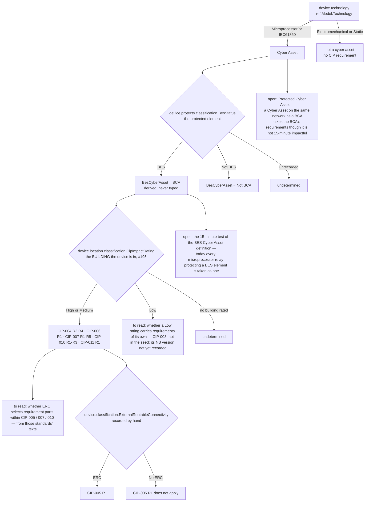
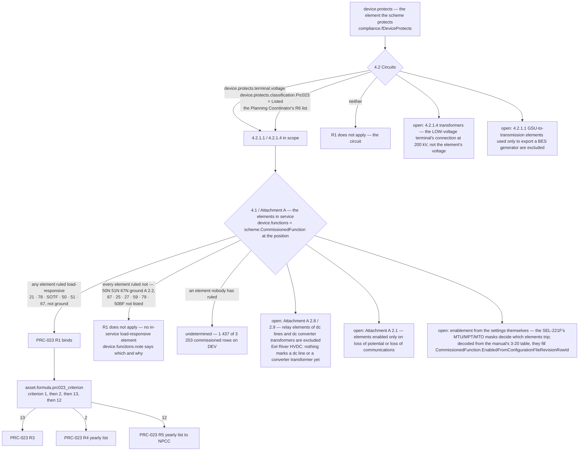
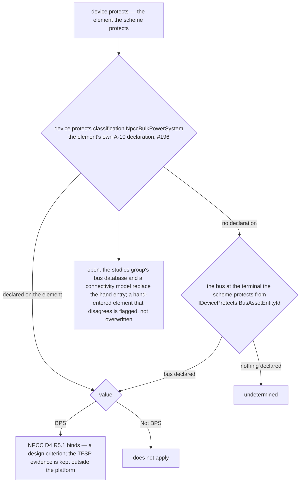

# Applicability — the layers that decide which standards bind a device

Started 2026-09-19 (#197) at the owner's request: *"These 'layers' of applicability for the various standards are incredibly
important as they are the kick off point for the various requirements … it would be valuable to start some form of
applicability flowchart for each of the standards so that we can build off of them … These are the things that we need to
ensure we get correct, so that devices don't fall through the cracks."*

One chart per standard. Every box names the fact the rule reads (`tools/compliance_rules.py` is the source of the rules;
`compliance.vFactCatalogue` of the facts). A box marked **open** is a layer the standard has and the platform does not
model yet; it is listed so it is not forgotten, not because a rule reads it. Nothing in a chart is a rule: the rules are
`Program.ObligationRule` definitions and the derivations `Program.ClassificationDerivation` definitions; the charts describe
them.

Conventions the charts share (rulings on record in `docs/decisions/DECISION-LOG.md`):

- **Nothing here is from memory** (the owner, 2026-09-19: *"when dealing with compliance, never go by memory, all must be
  verified against the particular standard in question"*). A box states what a standard says only when that standard's
  text, in the version in force in New Brunswick, was read and the clause is named. A layer the standard is believed to
  have but whose text has not been read is a **to read** box: it names the document to open, not what it says.
- **Applicability comes from the primary asset and the device's own nature** (#171, memory
  `feedback-applicability-from-primary-assets`): the element the scheme protects carries the BES status, the PRC-023 listing
  and the A-10 declaration; the building carries the CIP impact rating (#195); the device carries what only it can — its
  technology, its routable connectivity, its elements in service.
- **Unknown is not false** (#171, #197): a fact nobody has recorded leaves the standard *undetermined* and the device on the
  undetermined list; the platform never declares a standard inapplicable on a fact it cannot read.
- **A standard that does not bind must not appear against the device** (#173) — but **the reason must** (#197): the
  Compliance tab lists each standard that does not apply with what the rule read.

## CIP-002 → CIP-004/005/006/007/010/011 (cyber security)

What the rules read today (`CIP_SCOPE`): `device.classification.BesCyberAsset = 'BCA' and
device.location.classification.CipImpactRating in {'High', 'Medium'}`; CIP-005 R1 adds
`and device.classification.ExternalRoutableConnectivity = 'ERC'` (`CIP_ERC_SCOPE`). The BCA flag is the derivation
`bes_cyber_asset`: BCA when `device.technology in {'Microprocessor', 'IEC61850'} and
device.protects.classification.BesStatus = 'BES'`, else Not BCA; undetermined while the element's BES status is unrecorded.

Open layers, in the owner's words (2026-09-19): *"Once a building has been deemed to be a particular level … then all devices
in that building will need to be categorized, no matter whether or not they are '15-minute impactful' or not to the BES …
any device which is located on the same network, whether or not it is impactful, has much the same requirements … these
devices would be categorized as PCA (protected cyber asset) since … if they were compromised, that would be a door into the
BCAs which are on the same network."* The platform has the facts a PCA layer needs in outline — `network.port`,
`network.vlan`, `network.services` on a device, and `device.connections` — but no rule reads them for this yet and no
classification kind `ProtectedCyberAsset` exists. To read before anything is built on them: whether external routable
connectivity selects requirement *parts* within CIP-005/007/010 (the note of 2026-09-19 that said so was from memory and
does not count), and what a Low impact rating carries (CIP-003). The PCA definition itself is to be read from the NERC
Glossary and CIP-002 before a rule is written; the owner's description above is the requirement, not the text.

## PRC-023-6 (transmission relay loadability)

What the rule reads today (`PRC_R1_SCOPE`, #197): `(device.protects.terminal.voltage >= 200kV or
device.protects.classification.Prc023 = 'Listed') and device.functions[load_responsive='true'] is not empty`. The function
ruling lives on `ref.AnsiFunction.LoadResponsive` / `LoadResponsiveBasis` (the core seed, each with its Attachment A
clause); a legacy code such as `50/51N` or `21-B` is judged by `ref.fAnsiLoadResponsive` (its numbers, ground when N or G
follows the digits). Read from PRC-023-6 itself (FERC letter order 2024-01-24), the copy `Seed_compliance_Standards_NB.sql`
cites.

## NPCC Directory 4 (bulk power system protection design)

## How a layer gets added

1. The fact first: a column, a classification kind, or a derivation — and its row in `compliance.vFactCatalogue` with the
   branch in `fFactRead` / `fFixedFactValue` that reads it.
2. Then the rule term, in `tools/compliance_rules.py`, regenerated into `Seed_config_ObligationRules.sql` (a new rule version
   by payload; the old obligations close on the next Effective run, with the reads that closed them).
3. Then the screen shows the fact where the rating is shown, and the reason line names it when the rule reads false.
4. Then this file: the box moves from **open** to a fact.
